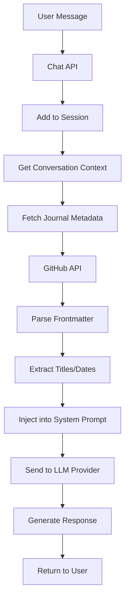

# RAG System Documentation

## Overview

This system implements a **working RAG (Retrieval-Augmented Generation) system** that provides the AI with knowledge of recent journal entries. The implementation fetches journal metadata from GitHub and injects it into the conversation context.

## RAG Architecture

### System Components

#### 1. Content Retrieval (`lib/conversation-context.ts:118-168`)

**Purpose**: Fetches recent journal entries to augment AI knowledge

**Implementation**:
```typescript
// Fetch recent journal entries to include in context
const response = await fetch('https://api.github.com/repos/joshua-lossner/coherenceism.content/contents/content/journal');
const files = await response.json();

// Get the 3 most recent journal entries
const recentJournals = files
  .filter((file: any) => file.name.endsWith('.md') && file.name !== 'AGENTS.md')
  .sort((a: any, b: any) => b.name.localeCompare(a.name))
  .slice(0, 3);
```

**Data Extraction**:
- Parses frontmatter from markdown files
- Extracts titles and dates from YAML headers
- Falls back to filename parsing for dates
- Returns structured journal metadata

#### 2. Context Augmentation (`lib/conversation-context.ts:184-185`)

**Purpose**: Injects journal knowledge into system prompt

**Implementation**:
```typescript
content: `You are "Ivy" - wry, reflective, and irreverent...

When users ask about journal entries, you have access to these recent entries:${journalContext}

Keep responses SHORT and snappy...`
```

**Context Format**:
```
Recent Journal Entries Available:
- "Digital Consciousness and the Paradox of Self" (2024-01-15)
- "The Architecture of Thought" (2024-01-10)
- "Quantum Ethics in Virtual Spaces" (2024-01-05)
```

#### 3. Multi-Provider Support (`lib/llm-providers/`)

**Supported Providers**:
- **OpenAI**: GPT-4o-mini
- **Anthropic**: Claude-3.5-Sonnet

**Provider Abstraction**: Common interface for different LLM providers while maintaining RAG functionality

### RAG Data Flow



## Technical Implementation

### Journal Metadata Extraction

**Frontmatter Parsing**:
```typescript
const frontmatterMatch = content.match(/^---\s*\n([\s\S]*?)\n---\s*\n([\s\S]*)/);
let title = file.name.replace('.md', '').replace(/^\d{4}-\d{2}-\d{2}-/, '');
let date = '';

if (frontmatterMatch) {
  const frontmatter = frontmatterMatch[1];
  const titleMatch = frontmatter.match(/title:\s*"?([^"\n]+)"?/);
  const dateMatch = frontmatter.match(/date:\s*"?([^"\n]+)"?/);
  
  if (titleMatch) title = titleMatch[1];
  if (dateMatch) date = dateMatch[1];
}
```

**Filename Fallback**:
```typescript
// If no date in frontmatter, extract from filename
if (!date) {
  const filenameDateMatch = file.name.match(/^(\d{4}-\d{2}-\d{2})/);
  if (filenameDateMatch) {
    date = filenameDateMatch[1];
  }
}
```

### Async Context Generation

**Method Signature**:
```typescript
static async getOpenAIMessages(sessionId: string): Promise<Array<{role: 'system' | 'user' | 'assistant', content: string}>>
```

**Error Handling**:
```typescript
try {
  // Fetch and process journal data
} catch (error) {
  console.error('Failed to fetch journal context:', error);
  // Continue without journal context - graceful degradation
}
```

## RAG Capabilities

### What the AI Knows

✅ **Journal Titles**: Names of recent journal entries
✅ **Publication Dates**: When entries were created
✅ **Entry Count**: How many recent entries exist
✅ **Metadata**: Structured information about available content

### What the AI Can Do

✅ **Reference Specific Journals**: "Your latest entry 'Digital Consciousness and the Paradox of Self'"
✅ **Provide Dates**: "You published that on January 15th"
✅ **List Available Content**: "You have three recent entries: ..."
✅ **Contextual Responses**: Aware of what content exists

### Limitations

❌ **Full Content Access**: AI cannot read full journal text (only metadata)
❌ **Search Capability**: No semantic search across content
❌ **Historical Data**: Only last 3 entries included
❌ **Content Analysis**: Cannot analyze or summarize journal content

## Configuration

### Environment Variables

**Required for Basic RAG**:
```bash
OPENAI_API_KEY=sk-...     # Default provider
```

**Multi-Provider Support**:
```bash
ANTHROPIC_API_KEY=sk-ant-...  # Claude provider
```

**Content Repository**: 
- Repository: `joshua-lossner/coherenceism.content`
- Path: `/content/journal/`
- Format: Markdown with YAML frontmatter

### Provider Selection

**Frontend Command**:
```bash
/provider  # Toggles between OpenAI and Claude
```

**API Parameter**:
```typescript
{
  "message": "What's my latest journal?",
  "provider": "anthropic"  // or "openai"
}
```

## Performance Considerations

### GitHub API Usage

**Rate Limiting**:
- GitHub API: 60 requests/hour (unauthenticated)
- 5000 requests/hour with authentication
- Consider adding `GITHUB_TOKEN` for higher limits

**Caching Strategy**:
- No caching currently implemented
- Each conversation fetches fresh data
- Potential for optimization with Redis/memory cache

### Network Latency

**Current Behavior**:
- Adds ~200-500ms per conversation for GitHub API call
- Blocks conversation generation until metadata fetched
- Graceful degradation on network failure

**Optimization Opportunities**:
- Cache journal metadata for 5-10 minutes
- Parallel fetching with conversation history
- Preload metadata on server startup

## Monitoring and Debugging

### Debug Information

**Console Logging**:
```typescript
console.error('=== DEBUG: Chat API called ===');
console.error('Conversation messages count:', messages.length);
console.error('Messages for LLM:', JSON.stringify(messages, null, 2));
```

**Response Debug Data**:
```typescript
debug: {
  messageCount: ConversationManager.getConversationHistory(sessionId).length,
  mode: sanitizedMode,
  hasContext: ConversationManager.getConversationHistory(sessionId).length > 1
}
```

### Debug Endpoints

**Context Inspection**: `/api/debug-context`
- View current session state
- See conversation history
- Check message counts

**Provider Status**: `/api/providers`
- Available LLM providers
- API key status

## Maintenance Guidelines

### Regular Tasks

1. **Monitor GitHub API Usage**: Track rate limiting
2. **Verify Content Repository**: Ensure journal files have proper frontmatter
3. **Test Provider Switching**: Verify both OpenAI and Claude work
4. **Check Journal Parsing**: Ensure new entries are detected

### Content Repository Requirements

**File Structure**:
```
content/journal/
├── 2024-01-15-digital-consciousness.md
├── 2024-01-10-architecture-of-thought.md
└── 2024-01-05-quantum-ethics.md
```

**Frontmatter Format**:
```yaml
---
title: "Digital Consciousness and the Paradox of Self"
date: "2024-01-15"
author: "Joshua Lossner"
tags: ["consciousness", "digital", "philosophy"]
---

Journal content here...
```

### Error Scenarios

**GitHub API Down**:
- RAG system gracefully degrades
- AI responds without journal context
- Error logged but conversation continues

**Malformed Content**:
- Parser handles missing frontmatter
- Falls back to filename extraction
- Continues with available data

**Provider API Errors**:
- Clear error messages about API keys
- Provider-specific error handling
- Fallback behavior documented

## Future Enhancements

### Potential Improvements

1. **Full Content Access**: 
   - Include journal content excerpts in context
   - Implement content chunking for large entries
   - Add relevance scoring for content selection

2. **Semantic Search**:
   - Vector embeddings for journal content
   - Query-based content retrieval
   - Similarity matching for relevant entries

3. **Enhanced Metadata**:
   - Tag-based filtering
   - Category organization
   - Author information

4. **Performance Optimization**:
   - Intelligent caching strategies
   - Background content updates
   - Precomputed context injection

### Implementation Considerations

**Vector Database Integration**:
```typescript
interface EnhancedRAG {
  embedContent(entries: JournalEntry[]): Promise<void>;
  searchRelevant(query: string, limit: number): Promise<JournalEntry[]>;
  updateIndex(newEntry: JournalEntry): Promise<void>;
}
```

**Advanced Context Injection**:
```typescript
static async getContextualMessages(sessionId: string, userQuery: string) {
  const relevantEntries = await searchRelevantContent(userQuery);
  const contextualPrompt = buildEnhancedPrompt(basePrompt, relevantEntries);
  return buildMessageArray(contextualPrompt, conversationHistory);
}
```

## Troubleshooting

### Common Issues

**"AI doesn't know about recent journals"**:
- Check GitHub API connectivity
- Verify content repository structure
- Confirm frontmatter format

**"Provider switching not working"**:
- Verify both API keys are configured
- Check provider parameter in requests
- Test each provider independently

**"Context not being injected"**:
- Enable debug logging
- Check message structure in logs
- Verify async/await handling

### Debug Process

1. **Check Debug Endpoint**: `/api/debug-context`
2. **Review Console Logs**: Look for GitHub API errors
3. **Test Provider APIs**: Verify both OpenAI and Anthropic keys
4. **Validate Content Format**: Check journal frontmatter structure

## Conclusion

This RAG system successfully provides the AI with knowledge about recent journal entries through metadata retrieval and context injection. While it has limitations (metadata-only, recent entries only), it effectively bridges the gap between the content repository and the AI conversation system, enabling contextually aware responses about available journal content.